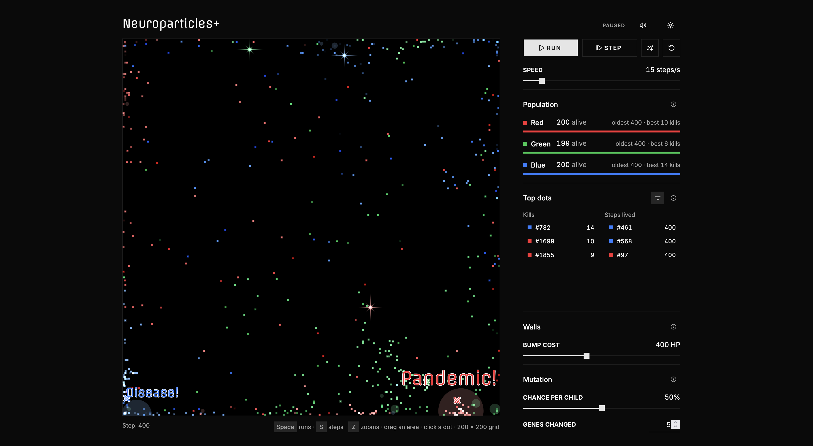

# Neuroparticles



Each teeny-weeny dot is a lil organism. It sees (using a neural network) what's around it and moves
depending on what it sees. If it survives long enough, it produces offspring. If not, bb lil dot, you
were brave, but other dots were more brave.

Three species, red, green and blue, share a 200×200 field in a rock-paper-scissors loop: red eats
green, green eats blue, blue eats red. Every dot has its own small neural network, and a genetic
algorithm breeds mature dots that stand near each other. Nobody programs the behavior; it comes out of local
sensing and selection pressure.

## Controls

| Control          | What it does                                                    |
| ---------------- | --------------------------------------------------------------- |
| Run / Pause      | Starts or pauses the simulation                                 |
| Step             | Advances one step while paused                                  |
| Randomize brains | Gives every dot a new random brain, after you confirm           |
| Chance per child | How likely a newborn is to mutate (0–100%)                      |
| Genes changed    | How many weights a mutation replaces                            |
| Theme toggle     | Switches light and dark; follows your system setting by default |

The sidebar shows the food cycle live: each species' dot grows and shrinks with its population, and
the rows under it show how many are alive and how long the oldest has survived. If a species dies out,
the run stops.

## How it works

**Perception.** Each dot sees a circle of 121 cells around it, 6 cells straight out and 4 along a
diagonal, counting red, green and blue dots separately and reading how much disease each cell costs:
484 numbers in all.

**Brain.** A fully connected network: 484 inputs → 25 sigmoid neurons (with biases) → 17 outputs, one
per move (16 directions or stay). The 8 main directions step to a neighboring cell; the 8 in-between
ones (NNE, ENE, …) are knight jumps, one cell along one axis and two along the other. The highest
output wins, with a small bonus for staying put.

**Speed.** Young dots (under 100 steps) and old ones (the last 20% of a life without food: 8,000
steps and up) only step to a neighboring cell. Adults in between can also knight-jump, so they are
the fastest.

**Health.** Every dot starts with 10,000 HP. Each step it loses 1 HP, and 100 HP more if it shares a
cell with its own kind. Bumping into
a wall costs 500 HP; the Walls slider changes that cost (0 to 1,000) while the sim runs. At 0 HP it
dies.

**Hunting.** A dot that ends a step on the same cell as its predator dies. The predators on that cell
split its HP equally, up to the 10,000 HP a dot starts with.

**Disease.** When more than 10 dots of one species stay in the same view-sized circle (121 cells) for
over 100 steps in a row, that circle becomes a disease area, tinted in that species' color. Every dot
inside, whatever its species, loses 500 HP per step at the edge, up to 1,000 HP at the center.
Overlapping areas don't add up. An area clears once no dot has been inside it for 100 steps.

**Evolution.** A genome is the flat list of all the network's weights and biases. When a species drops
below 199 dots, it refills with children bred from mature dots that stand near each other:

- **Selection:** a dot can breed once it has lived 100 steps. The best hunters go first: mature dots
  pair up in order of prey caught per step lived. Each takes the best free mature dot inside its
  view, or the best one anywhere when it sees none. A dot breeds once per step.
- **Litter:** a pair gets 2 children 90% of the time, 1 child 9% and 3 children 1%, never more than
  the species has room for.
- **Crossover:** uniform. Each gene of a child comes from one of the two parents. Twins split the
  parents' genes between them.
- **Mutation:** with the chosen chance, a newborn gets that many weights replaced by random values in
  `[-2, 2)`.
- **Placement:** the first child appears halfway between its parents, its siblings on the cells next
  to it. When the parents can't see each other, the children appear next to the first parent. All
  start with full HP.

**World.** The 200×200 grid has walls at the edges: a dot that steps into one bounces back, and
dots see the walls inside their view. All dots move at the same time, each
reacting to where everyone was at the end of the previous step.

## Development

Requires Node.js. Built with TypeScript, React, [shadcn/ui](https://ui.shadcn.com) and Tailwind CSS,
bundled with Vite.

```sh
npm install
npm run dev      # dev server at http://localhost:5173
npm test         # unit tests (Vitest)
npm run build    # typecheck, then a static site in dist/
```

`dist/` uses relative paths, so it can be hosted from any folder. Open it through a server
(`npm run preview` works); browsers block ES modules on `file://`.

| Path                | What's there                                                             |
| ------------------- | ------------------------------------------------------------------------ |
| `src/sim/`          | The simulation in plain TypeScript: network, perception, evolution, step |
| `src/sim/config.ts` | Every tunable constant: grid size, population, HP rules, mutation range  |
| `src/hooks/`        | `useSimulation` (runs the sim outside React) and `useTheme`              |
| `src/components/`   | The page: canvas, controls, food cycle, species stats, mutation          |

## Credits

Neuroparticles was created by **Serhii Herasymov** ([xcontcom](https://github.com/xcontcom)). The
simulation, the neural network and genetic algorithm design, and the RGB predator-prey mode all come
from the [original project](https://github.com/xcontcom/neuroparticles).

This fork keeps that simulation and rebuilds everything around it: TypeScript modules with unit tests,
a React and shadcn/ui interface, and a stop when a species dies out.

## License

MIT. The original copyright notice is kept in [LICENSE](LICENSE).
